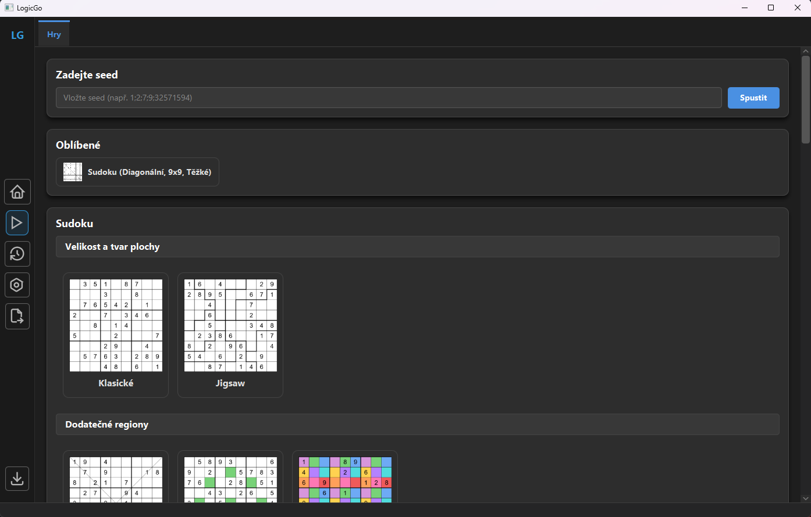
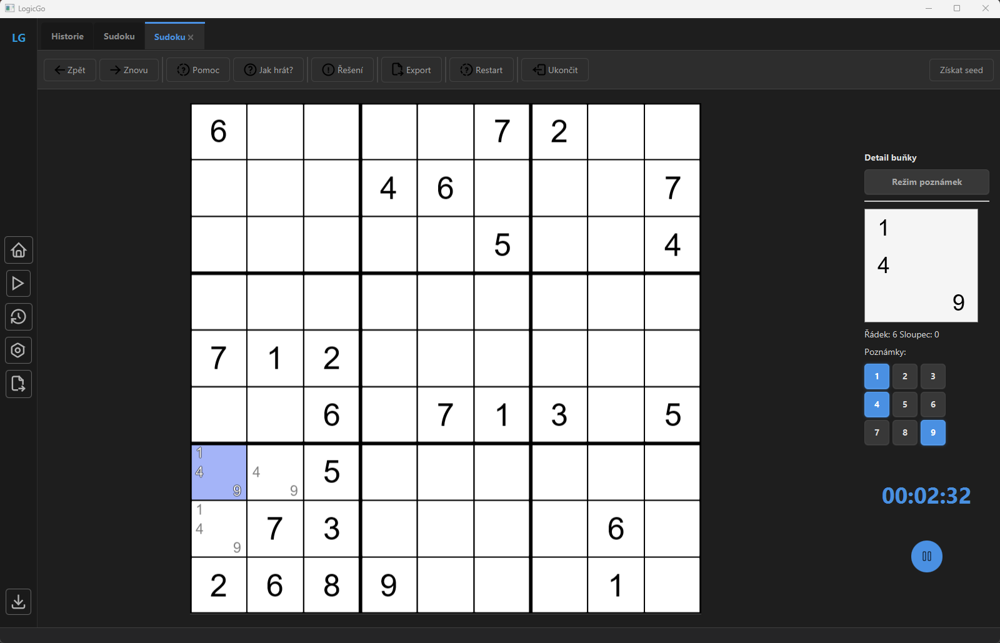
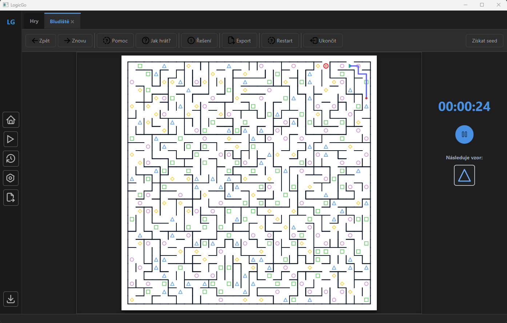
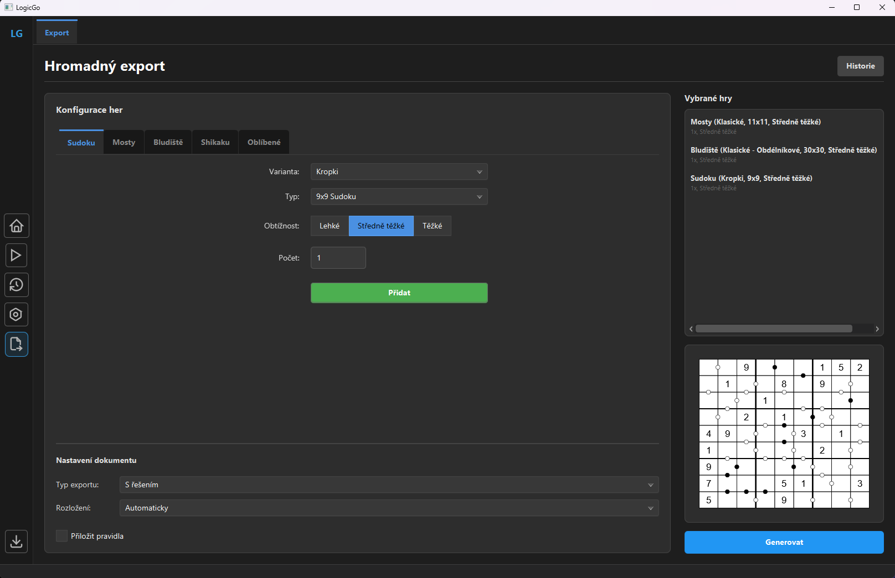

# LogicGo

LogicGo je desktopová aplikace vytvořená v jazyce Java pro Windows určená k hraní, generování a řešení logických úloh. Umožňuje hráči si vybrat jednu z implementovaných her, tyto hry si zahrát, případně vytisknout na papír.

## Ukázky z aplikace

### Výběr her


### Sudoku s kandidáty


### Bludiště se vzory


### Hromadný export a konfigurace


## Použité technologie a architektura

- **Jazyk:** Java 25
- **Uživatelské rozhraní:** JavaFX
- **Databáze a ORM:** SQLite, Hibernate ORM (Jakarta Persistence / JPA)
- **Generování PDF:** OpenPDF
- **Sestavovací nástroj:** Apache Maven

---

## Hlavní funkce

- **Garance jednoho řešení:** Každá vytvořená hra má garantované právě jedno řešení.
- **Podpora více her a jejich variant:**
  - **Sudoku:** Aplikace nabízí klasické mřížky i varianty jako Killer sudoku nebo Samurai sudoku. Podporuje režim kandidátů a různé velikosti hrací plochy.
  - **Mosty (Hashiwokakero):** Nabízí klasickou variantu hry Mosty i verzi s více mosty.
  - **Shikaku:** Nabízí klasické Shikaku a variantu Liar Shikaku.
  - **Bludiště:** Nabízí generování bluďišť pomocí různých algoritmů s možností použití tvarových masek a variantami jako průchozí zdi průchod checkpointy či průchod vzory.
- **Systém nápovědy a řešitel:** Aplikace hráči nabízí nápovědy a umožňuje také zobrazit kompletní řešení hlavolamu.
- **Hromadný export do PDF:** Umožňuje vytvořit PDF s více typy hlavolamů v jednom dokumentu.
- **Lokální profily a historie:** Oddělený postup pro jednotlivé hráče na zařízení.

---

## Inspirace

Při návrhu generátorů a herních mechanik posloužily jako inspirace tyto online projekty:

- [Sudoku-puzzles.net](https://sudoku-puzzles.net) – agregátor a export sudoku
- [Hashi Puzzles](https://hashi-puzzles.com/) – herní principy a řešič pro Mosty
- [MazeGenerator.net](https://www.mazegenerator.net) – topologie a konfigurace bludišť
- [Shikaku.ch](https://shikaku.ch) – online rozhraní pro hlavolam Shikaku

---

## Instalace a spuštění

### 1. Samostatný instalátor (doporučeno)

1. Stáhněte nejnovější balíček `LogicGo.msi` ze záložky **Releases**.
2. Spusťte instalátor a zvolte cílový adresář (výchozí: `C:\Program Files\LogicGo`).
3. Spusťte aplikaci přes zástupce na ploše nebo v nabídce Start.

> Uživatelská data, databáze a historie se ukládají do systémové složky `C:\ProgramData\LogicGo`.

### 2. Sestavení ze zdrojových kódů

#### Požadavky
- **JDK 25** nebo novější
- **Apache Maven 3.9+**
- **Git**

#### Postup sestavení

```bash
# 1. Klonování repozitáře
git clone https://github.com/hradma10/LogicGo
cd LogicGo

# 2. Sestavení projektu
mvn clean package -DskipTests

# 3. Spuštění aplikace
java -jar .\logicgo-ui\target\LogicGo.jar
